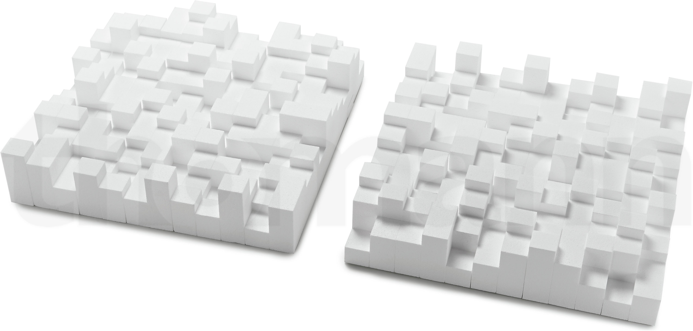
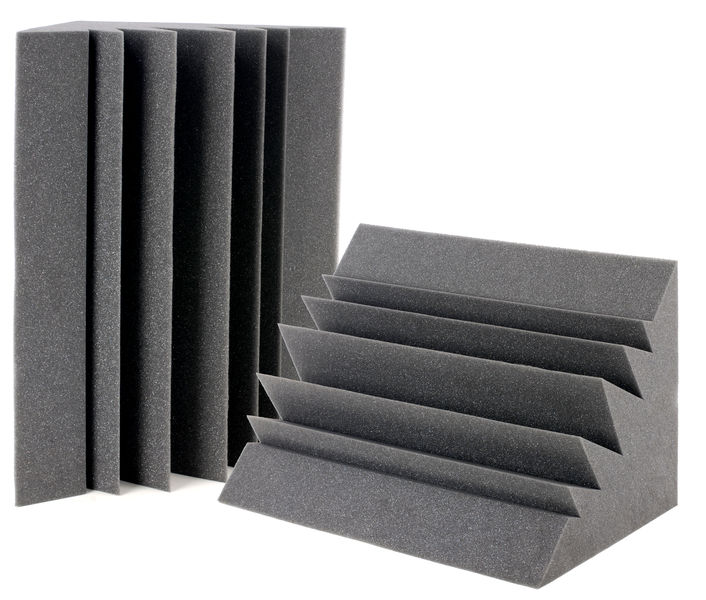
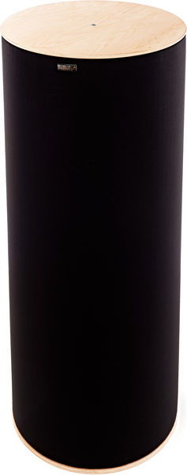

# Grundproblem
- man hört sich nicht
- man hört andere nicht
- die Ohren klingeln
- häufige Ursache: schlechte Akustik mit Lautstärke kompensieren oder allgemein zu hohe Lautstärke
  - nicht gut für den Sound
  - nicht gut für die Ohren

Das kann man aus 3 Richtungen angehen:
1. Positionierung der Schallquellen und Menschen
2. Akustik des Raumes verändern
3. Sound der Instrumente abstimmen/anpassen

# 1 - Proberaum Aufstellung
## Grundprinzipien
**Bass**
- idR in die Ecke
- tiefe Frequenzen verteilen sich eh leicht im Raum
- Ecke hilft dabei
- dadurch kann ggf. sogar Lautstärke runter ohne Verlust

**Gitarre**
- Gitarristen gegenüber des eigenen Amps
- Amps möglichst auf Kopfhöhe oder auf Kopf gerichtet
  - wahrgenommene Lautstärke Mitten/Höhen stark richtungsabhängig
  - also kleiner Tisch oder Amp ankippen

**Gesang** 
- Sänger schaut PA Boxen an
- keine Schallquelle direkt auf Mikro richten
- nicht vor nackte Wand stellen
  - Reflektion der Wand sorgt schnell für Feedback
  - vor einer Wand mit Absorption is gut

**Drums**
- "zentral", sodass alle gleich gut hören

## Mögliche Aufstellung

# 2 - Schalldämpfung / Akustik optimieren

## Dämpfung / Absorption

### Warum wichtig?
- nackte, harte Flächen reflektieren Schall => Echos
- undefinierter Sound
- "Ich hör mich nicht" -> lauter machen -> andere hören sich nicht -> lauter machen -> ...

### Wie erreicht?
- parallele glatte Flächen vermeiden
- Akustikschaumstoff

- in Falten gehangener Bühnenstoff
  - nur für hohe Frequenzen wirklich effektiv!
  - \>= 500 g/m^2

- Decke: in Wellen gehangener Bühnenstoff
  - Wellen vermeiden "glatte" Flächen
  - mehr Luft zwischen Stoff und Decke = mehr Absorption

- zu viel Absorption kann Dynamik killen -> "trockener" Sound
  - eher relevant, wenn man zu viel Geld in Akustikschaum investiert hat

- für tiefe Frequenzen: Bassfallen
  - wichtig in den Ecken 
  - brauchen idR viel Volumen

## Streuung / Diffusion
### Warum wichtig?
- Alternative/Ergänzung der Absorption
- statt Schall zu absorbieren, wird dieser gestreut
- verhindert auch Echos
- verteilt den Sound besser im Raum

### Wie erreicht?
- harte, nicht-glatte / unregelmäßige Flächen
- Regale

## Beispiele

**Absorber**

**Diffusor**

**Bassfallen**

 

# 3 - Sound Abstimmung / Optimierung

## Drums
- so laut wie nötig, so leise wie möglich
- ggf. dünnere Sticks
- Nachhall von Toms / Bass drum dämpfen
  - (Gaffa drauf?)
- Dünne Becken
  - Dicke, lang klingende Becken nehmen alle Frequenzbereiche ein
  - drücken damit alle anderen Instrumente weg
  - Folge: kein anderer hört sich mehr

- dicker Teppich unterm Schlagzeug 

## Gitarren
- idR Bass runter/raus
  - für tiefe Frequenzen ist der Bass zuständig
- Mitten akzentuieren
  - v.a. bei Rhythmus
- Gain nur so viel wie nötig
- Fokus der Frequenzen zwischen den Gitarren aufteilen
  - vermeidet Überlagerungen
  - Gitarren können differenziert wahrgenommen werden

## Bass

# Zum Nachlesen
[Thoman Blog, kurz, Absorption, Diffusion, Bassfallen](https://www.thomann.de/blog/de/akustik-verbessern-im-proberaum-tipps-tricks/)

